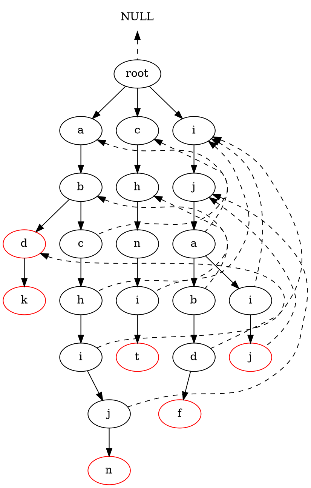
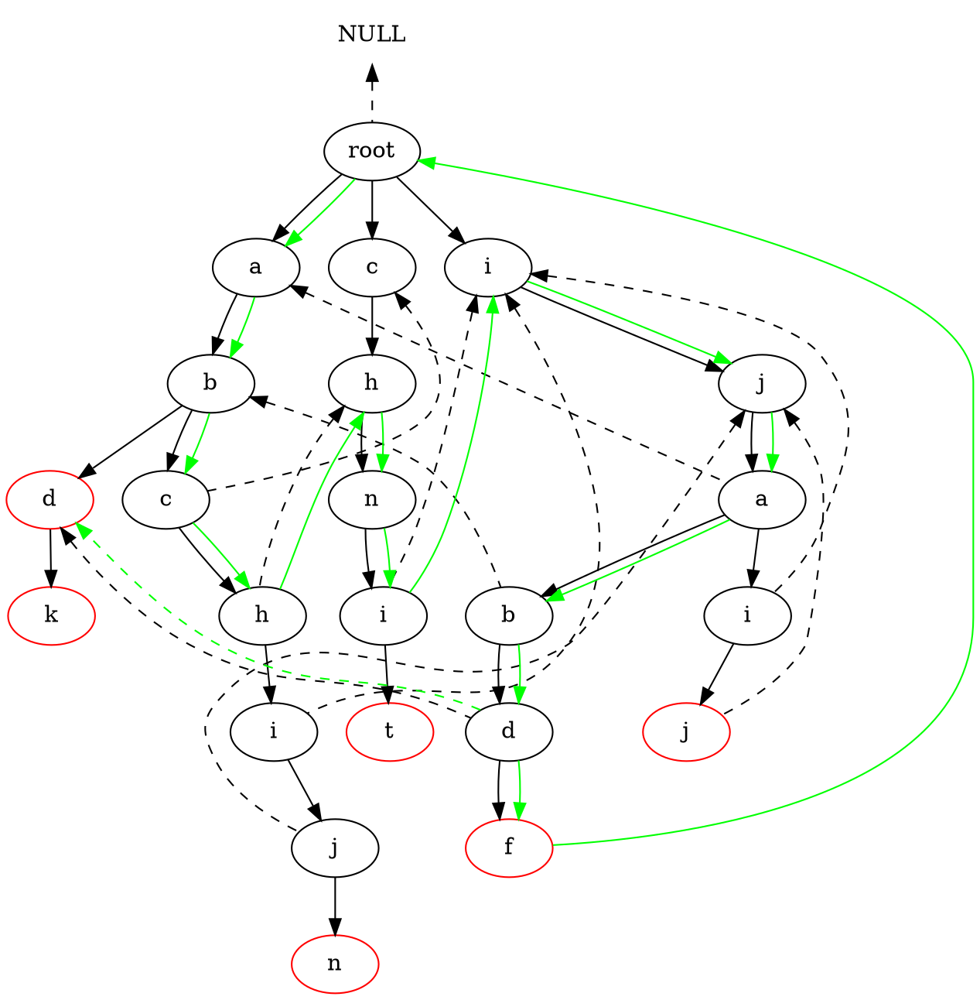

# AC多模匹配自动机

## AC自动机思想

AC自动机在实现上要依托于Trie树（也称字典树）并借鉴了KMP模式匹配算法的核心思想。实际上你可以把KMP算法看成每个节点都仅有一个孩子节点的AC自动机。

## 运行原理

- 1. 初识AC自动机

    AC自动机的基础是Trie树。和Trie树不同的是，树中的每个结点除了有指向孩子的指针（或者说引用），还有一个fail指针，它表示输入的字符与当前结点的所有孩子结点都不匹配时(注意，不是和该结点本身不匹配)，自动机的状态应转移到的状态（或者说应该转移到的结点）。fail指针的功能可以类比于KMP算法中next数组的功能。

    我们现在来看一个用目标字符串集合{abd,abdk, abchijn, chnit, ijabdf, ijaij}构造出来的AC自动机

上图是一个构建好的AC自动机，其中根结点不存储任何字符，根结点的fail指针为null。虚线表示该结点的fail指针的指向，所有表示字符串的最后一个字符的结点外部都用红圈表示，我们称该结点为这个字符串的终结结点。每个结点实际上都有fail指针，但为了表示方便，本文约定一个原则，即所有指向根结点的 fail虚线都未画出。

从上图中的AC自动机，我们可以看出一个重要的性质：每个结点的fail指针表示由根结点到该结点所组成的字符序列的所有后缀　和　整个目标字符串集合（也就是整个Trie树）中的所有前缀 两者中最长公共的部分。

比如图中，由根结点到目标字符串“ijabdf”中的 ‘d’组成的字符序列“ijabd”的所有后缀在整个目标字符串集{abd,abdk, abchijn, chnit, ijabdf, ijaij}的所有前缀中最长公共的部分就是abd，而图中d结点（字符串“ijabdf”中的这个d）的fail正是指向了字符序列abd的最后一个字符。

- 2. AC自动机的运行过程

    - 1 ) 表示当前结点的指针指向AC自动机的根结点，即curr = root
    - 2 ) 从文本串中读取（下）一个字符（i）
    - 3 ) 从当前结点的所有孩子结点中寻找与该字符匹配的结点，
        - 3.1 )若存在：curr节点指向匹配节点(curr = curr->next[i])，并判断curr结点以及curr的fail链条上所有节点是否表示一个字符串的结束，若是，则将命中模式串在文本串中的起点记录到结果集合中（命中模式串在文本串中的起点 = 当前偏移量-命中字符串长度+1）。返回继续执行步骤2)
        - 3.2 )若不存在：执行第4步。
    - 4 ) 检测curr->fail是否为NULL
        - 4.1 )是NULL（说明curr==root，且root下无所需字符）。返回继续执行步骤2)

        - 4.2 )不是NULL（curr有fail指针）。curr指向其fail（curr = curr->fail），重复执行步骤3)
    
现在，我们来一个具体的例子加深理解，初始时当前结点为root结点，我们现在假设文本串text = “abchnijabdfk”。

图中的实曲线表示了整个搜索过程中的当前结点指针的转移过程，结点旁的文字表示了当前结点下读取的文本串字符。比如初始时，当前指针指向根结点时，输入字符‘a’,则当前指针指向结点a，此时再输入字符‘b’,自动机状态转移到结点b,……，以此类推。图中AC自动机的最后状态只是恰好回到根结点。

需要说明的是，当指针位于结点b（图中曲线经过了两次b,这里指第二次的b，即目标字符串“ijabdf”中的b）,这时读取文本串字符下标为9的字符（即‘d’）时，由于b的所有孩子结点（这里恰好只有一个孩子结点）中存在能够匹配输入字符d的结点,那么当前结点指针就指向了结点d，而此时该结点d的fail指针指向的结点又恰好表示了字符串“abc”的终结结点（用红圈表示），所以我们找到了目标字符串“abc”一次。这个过程我们在图中用虚线表示，但状态没有转移到“abd”中的d结点。

在输入完所有文本串字符后，我们在文本串中找到了目标字符串集合中的abd一次，位于文本串中下标为7的位置；目标字符串ijabdf一次，位于文本串中下标为5的位置。

- 3. 构造AC自动机的方法与原理

    - 3.1 构造的基本方法

        - 1 ) 建造Trie树，默认root的fail为空，其他节点的fail为root。
        - 2 ) 使用递归或者链表方式，**按层级遍历字典树**，针对每个node节点（不含root：NULL != node->fail），建立其child的fail指针;原则如下：
            - 2.1 ) 遍历node的子节点，如果i子节点存在(node->next[i] != NULL -->  child = node->next[i];)则执行2.2）
            - 2.2 ) 遍历node的fail链，(fail = node->fail; while (fail != NULL) fail = fail->fail;), 直到fail指向NULL或者fail的i子节点也存在(fail->next[i] != NULL);如果fail的i子节点存在，那么child节点的fail指向fail节点的i子节点(child->fail = fail->next[i])
